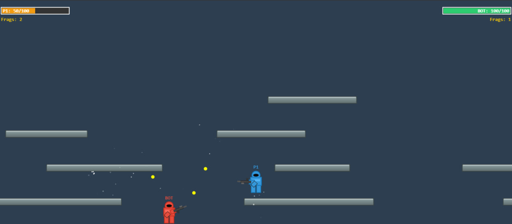

# Homenaje Armor Mayhem

Un pequeño homenaje al clásico juego Flash **Armor Mayhem**: un duelo en 2D donde el último en pie gana. Construido con JavaScript puro, sin dependencias externas.

[▶ Jugar](https://diegocastillovasquez.github.io/Homenaje_Armor_Mayhem)



---

## Características

- **Modo 1 Jugador**: Enfréntate a un BOT con inteligencia artificial.
- **Modo 2 Jugadores**: Combate local en la misma pantalla (misma máquina/teclado).
- **3 Dificultades**: Fácil, Medio y Difícil. Afectan la velocidad, precisión, daño, cadencia de disparo y comportamiento del BOT.
- **Sistema de frags**: El primer jugador en alcanzar **5 bajas** gana la partida.
- **Sistema de reaparición**: Al morir, el jugador reaparece en un punto aleatorio del mapa.
- **Efectos visuales**: Partículas al morir y al impactar proyectiles con plataformas.
- **Cámara dinámica**: Sigue al jugador (o al punto medio entre ambos en modo 2J) con límites del mapa.

---

## Controles

### Jugador 1 (P1)

| Acción | Modo 1J | Modo 2J |
|--------|---------|---------|
| Moverse | <kbd>A</kbd> / <kbd>D</kbd> | <kbd>A</kbd> / <kbd>D</kbd> |
| Saltar | <kbd>W</kbd> | <kbd>W</kbd> |
| Apuntar | Ratón | Antihorario: <kbd>Q</kbd> / Horario: <kbd>E</kbd> |
| Disparar | Clic izquierdo | <kbd>S</kbd> |

### Jugador 2 (P2) — solo modo 2J

| Acción | Teclas |
|--------|--------|
| Moverse | <kbd>J</kbd> / <kbd>L</kbd> |
| Saltar | <kbd>I</kbd> |
| Apuntar | Antihorario: <kbd>U</kbd> / Horario: <kbd>O</kbd> |
| Disparar | <kbd>K</kbd> |

---

## Cómo jugar

1. En la pantalla de inicio, selecciona el **modo de juego** (1 o 2 jugadores).
2. Si eliges 1 jugador, selecciona la **dificultad** del BOT.
3. Presiona **JUGAR** y derrota a tu oponente hasta llegar a **5 frags**.
4. Tras una muerte, tu personaje reaparecerá automáticamente en un punto aleatorio del mapa.

---

## Estructura del proyecto

```
├── index.html              # Página principal: pantallas de inicio y game over
├── estilos.css             # Estilos visuales de pantallas y menús
├── favicon.png             # Icono de la pestaña
├── captura_1.png           # Captura del juego
└── js/
    ├── main.js             # Punto de entrada: inicialización, game loop y colisiones
    ├── constants.js        # Constantes del juego (física, límites, config de dificultad)
    ├── state.js            # Estado global compartido (pantalla y frags)
    ├── input.js            # Clase Input: manejo de teclado y ratón
    ├── camera.js           # Clase Camara: seguimiento del jugador y límites del mapa
    ├── mapData.js          # Datos del mapa: plataformas y puntos de reaparición
    ├── hud.js              # HUD: barras de salud y contador de frags
    ├── entities/
    │   ├── Entity.js       # Clase base Entidad: física, disparo, daño, muerte y reaparición
    │   ├── Player.js       # Jugador 1 (movimiento WASD + rotación de apuntado QE + disparo S)
    │   ├── Player2.js      # Jugador 2 (movimiento IJKL + rotación de apuntado UO + disparo K)
    │   └── Enemy.js        # BOT con IA (comportamientos de combate, retirada, etc.)
    └── objects/
        ├── Platform.js     # Plataforma estática (colisiones y dibujado)
        ├── Projectile.js   # Proyectil (trayectoria, daño y propietario)
        └── Particle.js     # Partícula visual (explosiones e impactos)
```

---

## Arquitectura del código

### Bucle principal (`main.js`)

El juego usa `requestAnimationFrame` con **delta time** normalizado a 60 FPS. Cada frame:

1. Limpia el canvas y aplica el fondo.
2. Si el estado es `'jugando'`, actualiza la cámara y traslada el contexto (`ctx.translate`).
3. Dibuja las plataformas y actualiza entidades (jugadores/BOT).
4. Recorre los proyectiles aplicando:
   - Eliminación fuera del mapa.
   - Colisiones con plataformas (genera partículas).
   - Colisiones con entidades (aplica daño al propietario correcto).
5. Actualiza partículas y dibuja el HUD.

### Sistema de entidades (herencia)

```
Entidad (base: física, disparo, daño, muerte, reaparición, dibujado)
├── Jugador  (P1: WASD + Ratón o teclado QE/S)
├── Jugador2 (P2: IJKL + UO/K)
└── Enemigo  (BOT con IA)
```

La clase base `Entidad` centraliza:

- **Física**: gravedad, fricción (suelo/aire), aceleración y velocidad máxima.
- **Colisiones AABB** con plataformas (horizontales y verticales).
- **Límites del mundo**: `aplicarLimitesDelMundo()` restringe la posición a los bordes del mapa (`MAPA_ANCHO` × `MAPA_ALTO`). Los muros laterales y el techo detienen a la entidad, y caer por debajo del mapa provoca la muerte.
- **Disparo**: proyectil con ángulo calculado hacia el punto de apuntado.
- **Ciclo de vida**: `recibirDaño()` → `morir()` → partículas + callback de frag → `reaparecer()` en un punto aleatorio.

### IA del enemigo (`Enemy.js`)

El BOT evalúa su entorno y cambia de comportamiento según la situación:

| Comportamiento | Condición | Acción |
|----------------|-----------|--------|
| **Inactivo** | El jugador está muerto o fuera de rango | Se mueve aleatoriamente |
| **Esquivar** | Un proyectil enemigo se acerca (< 150 px) | Se aleja y salta |
| **Retirada** | Salud baja (umbral según dificultad) y jugador cerca | Huye disparando |
| **Agresivo** | El jugador tiene poca salud (< 30%) | Persigue y dispara intensamente |
| **Combate** | Rango normal | Mantiene distancia óptima, strafe y dispara |

La máquina de estados se reevalúa cada frame, y los umbrales/probabilidades dependen de la dificultad seleccionada.

### Configuración de dificultad (`constants.js`)

Cada dificultad define los parámetros del BOT:

| Parámetro | Fácil | Medio | Difícil |
|-----------|-------|-------|---------|
| Velocidad | 1.5 | 2.0 | 3.5 |
| Cadencia de disparo (frames) | 25 | 15 | 8 |
| Precisión | 60% | 80% | 95% |
| Daño por proyectil | 8 | 10 | 12 |
| Probabilidad de esquivar | 40% | 60% | 85% |

---

## Detalles técnicos

- **Canvas 2D** de ventana completa, redimensionado automáticamente.
- **ES Modules** (`import`/`export`) sin framework ni dependencias externas.
- **Mapa**: 1920×800 px con 11 plataformas y 8 puntos de reaparición.
- **Sistema de unidades**: las coordenadas del mundo son relativas a la cámara (traslación del contexto).
- **Física por frame**: gravedad `0.6`, salto `-14`, velocidad de proyectil `15`.
- **Apuntado con teclado**: la rotación del arma en modo 2J usa `VEL_ROTACION = 0.05` rad/frame (~3 rad/s a 60 FPS, una vuelta completa en ~2.1 s). Aplica a P1 (<kbd>Q</kbd>/<kbd>E</kbd>) y P2 (<kbd>U</kbd>/<kbd>O</kbd>). Todas las constantes de física usan unidades por frame normalizadas a 60 FPS.
